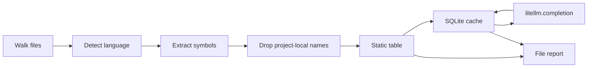

# findio engineering design

findio scans one or more repositories and reports which files are likely to perform I/O, and which imported APIs or global commands made them look that way. A later step, outside this tool, reads those files with an AI and turns the findings into container runtime dependencies. The classification only has to be a good filter.

This document is the implementation plan for `~/containeraize/findio`. Generating Dockerfiles and Compose files is out of scope.

## Decisions

- Python package, library first, thin CLI on top. The parent tool calls `findio.scan()`.
- Tree-sitter identifies the language and extracts imports and the calls rooted on those imports. One parse per file.
- Languages whose I/O commands live in the global namespace (shell, PHP, C, and others below) also yield bare calls. Languages where I/O is imported do not.
- The model classifies **symbols**, not files and not call sites. `requests.get` and the shell command `curl` are each classified once and reused in every file and every later run.
- Model calls go through the [LiteLLM](https://github.com/BerriAI/litellm) library: `litellm.completion()` with a `provider/model` string. LiteLLM selects the provider and calls it directly. Credentials are that provider's own environment variables. No proxy is part of the setup.
- Only symbol names go to the model. Source text stays local.
- Each label is `io` plus `kinds` (`filesystem`, `network`, `service`, `process`, `database`). Kinds are a hint for the later investigation. A wrong or incomplete kind is acceptable.
- The cache stores one classification per language and symbol. A batch response is split and written as separate rows. The batch request itself is never cached.
- The report groups by symbol. Each group lists the files that reference it. Files with no I/O symbol are omitted.
- Gitignored and vendored trees are skipped. Imports that resolve inside a scanned root are not classified; those files are scanned themselves. Declarations from every root in one scan form one set.

## Pipeline



1. Walk the tree.
2. Detect a language and parse.
3. Extract symbols with that language's extractor.
4. Drop names defined in any scanned root.
5. Deduplicate the remaining `(language, module, symbol)` keys.
6. Ask the static table. Look up each miss in the cache. Send the remaining misses to LiteLLM, in batches of one language, one call at a time. Split each response and insert one row per symbol.
7. Join the I/O labels back onto the files that referenced them, then group the report by symbol.

Stderr prints one line at each phase: `walk`, `parse`, `filter N`, `classify`, and `report N`. `walk` is printed when the directory walk starts, and `walk N` when the file list is ready. Parsed files are printed during `parse` as `path language`. `filter` counts the distinct symbols left after project-local names are dropped.

## Layout

```
findio/
  pyproject.toml
  docs/design.md
  src/findio/
    __init__.py           # scan
    cli.py
    walk.py
    detect.py
    extract.py            # one extractor function per language
    classify.py
    ai.py                 # litellm.completion wrapper
    cache.py
    report.py
    text.py               # source decoding
  tests/
    test_classify.py
    test_walk.py
    test_detect.py
    test_ai.py
    test_text.py
```

The package targets Python 3.11+. The current host is 3.14.

## Walking files

`walk.py` yields regular files under each repository root. One root keeps paths relative to that root. Several roots prefix each path with the root directory name (`left/main.go`), and a repeated name becomes `name-2`.

Skip:

- `.git`, and anything matched by the root `.gitignore` (`pathspec`)
- dependency and build trees even if not ignored: `node_modules`, `vendor`, `venv`, `.venv`, `dist`, `build`, `target`, `__pycache__`. A directory named `build` is scanned when a file directly inside it is source findio extracts (Python, JavaScript, TypeScript, Go, Rust, Java, Kotlin, C, C++, PHP, Ruby, PowerShell, or shell). A nested source file does not keep it, and JSON or object files do not either.
- files larger than 10 MiB
- files that contain a NUL byte in the first 8 KiB

`--no-ignore` disables gitignore and the extra directory skip list. The size and binary checks stay.

Paths in the report are relative POSIX paths. With more than one root they include that root's directory name. Declarations from every root form one set, so a symbol defined in any root is internal to the others.

## Language detection

Tree-sitter parses a file only after a grammar is chosen. Detection is:

1. `tree_sitter_language_pack.detect_language(path)` (extension, then shebang). Unix shell dialects (`bash`, `sh`, `dash`, `zsh`, `ksh`, `fish`, and the other common interpreters) are reported as `shell`. The parse uses that dialect's grammar when the pack has one.
2. Parse. If the tree's error-node share is above 0.05, skip the file. The pack does not expose `extension_ambiguity`. A `.h` file is C++ when that grammar has a strictly lower error share than C. Equal shares stay C.
3. No grammar, or every parse still mostly errors: skip the file. It is not listed on stderr.

Grammars come from `tree_sitter_language_pack.get_parser`. The pack downloads a grammar on first use.

Source bytes are decoded before that parse. A byte-order mark, a `coding:` cookie in the first two lines, and strict UTF-8 are tried first. UTF-16 and UTF-32 without a mark are recognized from their layout. Latin-1 is the last resort, so an undeclared 8-bit file still decodes; the cookie is what selects Windows-1252, Shift-JIS, and the other encodings Python knows. The decoded text is passed to tree-sitter as UTF-8. A NUL in the first 8 KiB still marks a binary file, except UTF-16 and UTF-32.

## Extraction

Two extractor modes. Each language has exactly one.

**Import-bound.** The file's imports form a binding table. A call is kept only when its root identifier is a binding. A short global list is added only when that language has I/O commands that are in scope without an import.

**Global namespace.** I/O is spelled as a bare command or function call, so unqualified calls are candidates. Imports, includes, `require`, and `source` are still extracted when the language has them.

`extract.py` holds every extractor. Each one walks tree-sitter nodes directly. There are no query files.

### Import-bound resolution

| Import form | Binding |
| --- | --- |
| `import requests` | `requests` → module `requests` |
| `import requests as r` | `r` → module `requests` |
| `from os.path import join` | `join` → module `os.path`, symbol `join` |
| `import fs from "fs"` / `require("fs")` | local name → module `fs` |
| `import { readFile } from "fs"` | `readFile` → module `fs`, symbol `readFile` |
| Go `import "os"` or `import f "os"` | package name → module `os` |
| Rust `use std::fs::read` or `use std::fs::read as r` | local name → module `std::fs`, symbol `read` |
| Rust `File::open` after `use std::fs::File` | module `std::fs::File`, symbol `open`; the type `File` on `std::fs` supplies the kind |
| `import * as fs from "fs"` | local name → module `fs` |
| `const { readFileSync: rf } = require("fs")` | `rf` → module `fs`, symbol `readFileSync` |
| Kotlin `import java.nio.file.Files as F` | `F` → `java.nio.file.Files` |
| PHP `use function file_get_contents as fgc` | `fgc` → `file_get_contents` |

| Call form | Symbol sent to the model |
| --- | --- |
| `requests.get(...)` | module `requests`, symbol `get` |
| `r.get(...)` with `import requests as r` | module `requests`, symbol `get` |
| `join(...)` from `from os.path import join` | module `os.path`, symbol `join` |
| `os.path.join(...)` with `import os` | module `os`, symbol `path.join` |
| `readFile(...)` from `import { readFile } from "fs"` | module `fs`, symbol `readFile` |
| PHP `\file_get_contents(...)` | module `""`, symbol `file_get_contents`; `Foo\bar(...)` is not that function |
| Python `open(...)` | module `""`, symbol `open` |
| PowerShell `gc a` | module `""`, symbol `Get-Content` |
| PowerShell `Dhcp = 'Enabled'` | not a command; a property assignment |
| PowerShell `HostsFile Add` | module `""`, symbol `HostsFile`; internal when that resource is defined in the repository |

The reported module and symbol are the original names. The local alias is only the binding key.

Attribute walks stop at the first call, subscript, or parenthesized expression. `requests.Session().get(...)` contributes `requests.Session` and does not follow `.get` onto the temporary. The file still shows up when the constructor is classified as I/O.

An import with no resolved call is still emitted as a module-level symbol (`symbol` empty). `import socket` with only dynamic use should not disappear.

Dynamic import strings that are not literals are ignored (`importlib.import_module(name)`, `import(expr)`).

### Globals

A global list exists only for languages that can perform I/O without an import. The list is part of that language's spec. It starts small and grows when a real repository shows a missed command.

Examples, not a closed set: Python `open` and `input`; JavaScript `fetch`; Ruby `system`, `exec`, `` ` ``, `spawn`, `IO`. Go and Rust have empty lists because their I/O is imported. Shell does not use this list; command names are the candidates (see below).

### Project-local names

In one scan, the repository is every root. Relative imports, and absolute imports whose first path segment matches a top-level package directory or module file in that file's own root (`src/` layouts included), are internal. They are not classified. A directory that exists only in another root does not make that import internal at extract time. The declaration filter still drops a symbol when that type or member is declared in any root.

For C, C++, PHP, and PowerShell, function and command names defined anywhere in the scanned repository are internal too. Shell functions are visible only along `source`, as described below. Each parsed file reports the functions it defines. After the walk, bare calls whose names are in that set are dropped, before classification. C and C++ share one set, so a declaration in a header covers a call in another file. A `static` C or C++ function stays out of that set and is dropped only in its own file. A C or C++ macro name is in that set as well, except a macro whose body is only another identifier: that call keeps the name of the external symbol it renames. PHP, shell, PowerShell, and Ruby each have their own set. PowerShell matches regardless of case. A shell function hides a bare call in the file that defines it, and in a file that reaches that file through literal `source` or `.` paths. `\. file` is the same include as `. file`. A variable path is not followed, so a function defined only in a test does not hide `npm` in a script that never sources the test. A shell call written as `command curl` is the external program, so a visible function named `curl` does not hide it. A DSC resource name is in the PowerShell set when a `.schema.mof` gives that `FriendlyName`, or when the module file is `DSC_<Name>.psm1`. A configuration that names that resource is internal. A resource this repository does not define stays. A Ruby call on a constant, such as `Site.read`, `Jekyll::Utils.safe_glob`, or `Utils::Internet.connected?`, is internal when that method is defined on that class or module. A relative path matches a suffix of the class. A call with no constant receiver, such as `doc.read` or `exist?`, is internal when any class in the repository defines that method. `File.read` stays, because `File` is not that class. `Site.new` stays when `new` is not defined on `Site`.

Package languages drop a symbol only when that type or member is declared in the repository. Sharing a package name is not enough: `com.example.Foo.read` is internal when `Foo.read` is declared, and `com.example.Foo.hashCode` is not. A field, a property, and an enum constant are members. An import written as `Foo.TYPE_DATA`, and a call whose receiver is that member, are internal. A nested type used as `Foo.Builder`, and a companion member used as `Foo.pin`, are internal when that type or companion member is declared. A call on a file-level property is internal. Java and Kotlin share those declarations. Go qualifies a function, a type, and a package-level variable or constant by the `go.mod` module path plus the file's directory. A declaration the grammar drops, such as a method with a type parameter, is still read from its source line. A call is internal when its first selector segment is one of those names, so `diagnostics.Hello.Code()` and `tspath.Path()` are internal when `Hello` or `Path` is declared in that package. `internal.Read()` stays when `Read` is not. A local variable hides an import of the same name, so `parser.parse()` is not that package when `parser` was assigned in that function. Rust qualifies a function by the Cargo package name and its `src/` module path. A hyphen in that name is also stored with underscores, so `grep-searcher` matches `grep_searcher`. A `pub use` in `src/lib.rs` stores the exported name at the crate root. `pub extern crate grep_cli as cli` in crate `grep` makes `grep::cli` another path to `grep_cli`. A struct, an enum, a trait, and an enum variant are stored the same way. An inherent method is stored on its type, so `WalkBuilder::new` is internal. A trait implementation is not. JavaScript, TypeScript, and TSX qualify an export by the `package.json` name and the file path. An import specifier is internal when it is a workspace package name, a `package.json` `imports` or `exports` key of that package (`#dep-types/*`, `vite/module-runner`), or a `tsconfig` `paths` key (`~utils`). Calls through that import are internal too. A file path such as `app/lib` stays member-by-member. Python, and relative imports in the other languages, are already internal when the first path segment is a directory or file in the repository. The file that contains the external call is scanned on its own. C# keeps a call whose receiver starts with an uppercase letter, so `File.ReadAllText` and `System.IO.File.WriteAllText` are symbols and `file.Read` is not. `using Alias = System.Net.Http` makes `Alias.HttpClient` that namespace. A method declared on a type in a scanned root is internal under both the simple name and the namespace-qualified name. A `using` of a namespace declared in a scanned root is internal. A bare `WriteLine()` is not a type call.

A stdlib module that shares a name with a top-level directory is treated as internal. That is acceptable for a filter.

### Shell

Shell is a global-namespace language and is in the first implementation cut. It is reported as `shell`, covering bash, zsh, fish, ksh, and the other Unix shells. The dialect grammar confirms the parse when the pack has one; otherwise the bash grammar does.

From each `command` node, take the command name (the first word). If that word is a wrapper, take the next word instead. Wrappers: `sudo`, `command`, `exec`, `env`, `nice`, `nohup`, `time`, `xargs`, `builtin`. `command curl` skips a function of that name, so the name stays even when the repository defines `curl`. `command "${VAR}"` and `$VAR` are resolved from assignments of `VAR` in the enclosing function. An empty literal is ignored. A quoted prefix followed only by `${NAME-}` keeps that prefix, so `make="make${FLAG-}"` and `make="gmake${FLAG-}"` report `make` and `gmake`. Any other computed value, or an assignment outside that function, leaves the call unresolved. Both `curl` and `wget` are reported when the function assigns each of them.

`source` and `.` of a literal path are internal script includes, same as a project import. `\. file` is the same include, including when an assignment precedes it (`NVM_ENV=testing \. file`) and when the parser attaches `\.` to the previous command. They are not classified. The sourced file's functions become visible to the caller, including through a chain of literal sources. A path that contains a variable is not followed.

A redirection (`<`, `>`, `>>`, `<>`, herestring, heredoc) is filesystem I/O by syntax. Record a hit with module `""`, symbol `redirect`, and kinds `["filesystem"]`, with no model call.

The command name is the symbol (`module` empty). `curl -fsSL https://example.com` yields symbol `curl`. Pipeline stages are each extracted. Assignments, `if`/`for`/`while`/`case`, and function definitions contribute no command symbol; the body still does.

### Languages

Import-bound, with call resolution, each a function in `extract.py`:

Python, JavaScript, TypeScript, TSX, Go, Rust, Java, Kotlin, Ruby, C#.

Global-namespace, with bare calls plus include, require, or source when the grammar has them:

Shell (bash, zsh, fish, ksh, dash, and the other Unix shells, reported as `shell`), PHP, C, C++, PowerShell.

C and C++ `#include` of a non-project header is a module-level symbol (`stdio.h`). An include is internal when its path is a file in the repository or a suffix of one, so `"http.h"` matches `lib/http.h` and `<curl/curl.h>` matches `include/curl/curl.h` even from another directory. Calls are bare names, then filtered against functions defined in the scanned C and C++ files. A C++ method is a member of its class. `StreamCopier::copyStream` is internal when `copyStream` is declared on `StreamCopier`, and an unqualified `doSomething()` is internal inside a class that declares it. An unqualified `read()` in a function that does not declare `read` stays. `::CreateFileW()` is the global function `CreateFileW`. Each macro body is parsed on its own, wrapped as a function, and calls in that body are recorded on the `#define` line. A callee that is a parameter, or another macro in the same file, is ignored. Call sites of a macro defined in the repository stay internal. The include itself remains.

Any other language the pack detects is parsed only to confirm the grammar, then dropped. It contributes no symbols. Dockerfiles and YAML are in that set.

## Classification

`classify.py` accepts the deduplicated symbols and returns labels. `StaticClassifier` answers from a fixed table. `lookup` returns that label, or nothing when the symbol is absent. `classify` turns an absence into not I/O. `CascadingClassifier` asks the static table first, then the cache, then `AIClassifier` for whatever is still unknown. A static hit is not written to the cache and is not sent to the model.

`ai.py` is the only place that calls LiteLLM. When `FINDIO_MODEL` is unset, or `litellm` cannot be imported, the CLI uses `StaticClassifier` alone and still writes the report. The same fallback applies when a completion fails because the provider, model, or endpoint is unusable: rows already stored stay, and every symbol not yet labeled stays not I/O.

`scan(client=None)` always uses the static classifier, including when `FINDIO_MODEL` is set. The CLI builds the cascade.

```python
litellm.completion(
    model=model,  # "openai/gpt-4o", "anthropic/claude-...", "ollama/..."
    messages=[{"role": "user", "content": prompt}],
    temperature=0,
    timeout=60,
    api_base=api_base,  # omitted unless set
    max_retries=0,
    retry_strategy="exponential_backoff_retry",
    retry_policy=retry_policy,
    service_tier="flex",  # only when the model name starts with "gemini/"
)
```

LiteLLM warnings, including provider deprecations, are not printed. A failed completion still prints findio's own line.

`timeout` is 60 seconds. A connection that never returns response headers fails with the LiteLLM unavailable line instead of waiting until the process is killed. `retry_policy` asks LiteLLM for 3 retries, with exponential backoff up to 10 seconds, when the provider is overloaded, unavailable, or the call times out. A rate limit is not retried there. findio waits the delay the provider asked for (`retryDelay`, `Please retry in`, or a `Retry-After` header), rounded up to the next second, and prints `findio: rate limited, retrying in Ns`. That wait happens up to 3 times. When the reply has no delay, the wait is 1s, then 2s, then 4s. Authentication and bad-request errors are not retried. `max_retries=0` keeps the underlying client from retrying as well.

| Variable | Meaning |
| --- | --- |
| `FINDIO_MODEL` | LiteLLM model string, `provider/model`. When unset, classification stays static. |
| `FINDIO_API_BASE` | Optional. Set only when that provider needs a custom endpoint (Ollama, vLLM, Azure). |

Provider credentials stay in the variables LiteLLM already reads (`OPENAI_API_KEY`, `ANTHROPIC_API_KEY`, and so on). findio does not introduce a key of its own.

Symbols are grouped by language, sorted, and split into batches of 30. One completion is in flight at a time; the next batch starts after the current response is parsed and its rows are written. Each call prints one stderr line before it starts, `classify language count` followed by every symbol in that batch. The prompt asks for JSON only:

```json
{
  "results": [
    {"module": "requests", "symbol": "get", "io": true, "kinds": ["network"]},
    {"module": "", "symbol": "curl", "io": true, "kinds": ["network"]}
  ]
}
```

`kinds` is a subset of `filesystem`, `network`, `service`, `process`, `database`. It is empty when `io` is false. When `io` is true and the kind is unclear, the model includes every kind that might apply. `io` may be a boolean or the string `true` or `false`. A result is kept when its `module` and `symbol` match the request, or when the joined `module.symbol` is the only name in the batch that matches that result.

| Kind | Examples |
| --- | --- |
| `filesystem` | `open`, `os.remove`, `fs.readFile`, `os.ReadFile` |
| `network` | `requests.get`, `fetch`, `net.Dial`, `http.Get`, `curl`, `Get-NetAdapter` |
| `service` | `boto3.client`, `gocloud.dev/blob/s3blob`, a LiteLLM or OpenAI client |
| `process` | `subprocess.run`, `child_process.execFile`, `os/exec` |
| `database` | `sqlite3.connect`, `psycopg.connect`, database drivers |

The prompt states:

- I/O means the API or command is likely to read or write files, use the network, start a process, talk to a database, or call a specific external service.
- `network` is generic network I/O. `service` is a client for one named external service, such as AWS S3 or a LiteLLM proxy, and is used instead of `network` for that client. An operating-system command that configures the local network stack, firewall, DNS client, adapters, or CIM is `network`, not `service`. Console output and a build runner, such as `Write-Host` or `Invoke-Build`, are not I/O.
- In-memory computation, math, and data-structure operations are not I/O.
- When unsure whether it is I/O, set `io` to true.
- When unsure which kind applies, include each kind that might. An incomplete kind list is fine; the later investigation reads the file.
- An empty `symbol` means the whole module.

These kinds are not used to choose packages, ports, or volumes here. They tell the later step why the file was selected. Running findio on real repositories may show that a kind is too coarse or too fine; the prompt version can change then.

If the response is empty, not valid JSON, or does not cover every item in the batch, stderr says the reply could not be used and names that reason, and the batch is split in half and retried, down to a single symbol, still one call at a time. A single symbol that still will not parse prints a stderr line with the same reason, is not I/O, and is not cached, so a later run can ask again. The report is written. Rows already written for earlier symbols stay in the cache.

As soon as a batch parses, each of its results is inserted under its own key, including `io: false`. Nothing is stored under the batch text, the message list, or the set of symbols in that request. The next run looks up symbols one by one, so a new batch that shares a symbol with an old batch does not repeat that call. `--refresh` skips the read and overwrites the rows the model returns.

SQLite writes happen on one connection in the parent process. `--jobs` applies to detection and extraction, not to model calls.

LiteLLM's response cache stays off. It would remember the whole completion, which is the wrong grain for batches whose membership changes every run.

## Cache

Path: `$XDG_CACHE_HOME/findio/classifications.sqlite`, or `~/.cache/findio/classifications.sqlite`. Override with `--cache`.

```sql
CREATE TABLE classifications (
  cache_key      TEXT PRIMARY KEY,
  language       TEXT NOT NULL,
  module         TEXT NOT NULL,
  symbol         TEXT NOT NULL,  -- empty string for module-level or a global
  model          TEXT NOT NULL,
  prompt_version TEXT NOT NULL,
  io             INTEGER NOT NULL,
  kinds          TEXT NOT NULL,  -- JSON array
  created_at     TEXT NOT NULL
);
```

One row is one symbol. `module` is part of the symbol identity so Python `get` on `requests` and `get` on `dict` do not share a row. `cache_key` is the SHA-256 of `prompt_version`, `model`, `language`, `module`, and `symbol`, joined with NUL bytes. `--refresh` ignores existing rows and overwrites them.

A failed batch stores nothing for the symbols it did not parse. Symbols parsed from an earlier successful batch remain. Structural hits such as shell redirects are not stored; they are `io: true`, `kinds: ["filesystem"]` without a lookup.

The same database is shared across repositories and across runs. A row does not depend on which file, repository, or batch produced it.

## Report

Version 3. The top level is the file. One file lists every I/O symbol found in it, with that symbol's lines. Files are sorted by path. Symbols in a file are sorted by kind, then language, then module, then symbol. Lines are sorted. The same symbol in two files appears under each file.

```json
{
  "version": 3,
  "root": "/abs/path/to/repo",
  "files": [
    {
      "path": "scripts/fetch.sh",
      "symbols": [
        {"language": "shell", "module": "", "symbol": "redirect", "kinds": ["filesystem"], "lines": [6]},
        {"language": "shell", "module": "", "symbol": "curl", "kinds": ["network"], "lines": [4]}
      ]
    },
    {
      "path": "src/client.py",
      "symbols": [
        {"language": "python", "module": "", "symbol": "open", "kinds": ["filesystem"], "lines": [7]},
        {"language": "python", "module": "requests", "symbol": "get", "kinds": ["network"], "lines": [18, 44]}
      ]
    }
  ]
}
```

`symbol` is `""` for a module-level hit. `module` is `""` for a global or a shell command. `root` is the absolute path of the single repository. With several roots it is those absolute paths joined by a newline, in the order given. File paths in that report are prefixed with the root directory name.

Plain text prints the same files. The heading is the path. Each following line is the kinds, the language, the qualified name (`module.symbol`, or whichever of the two is set), and the lines.

```
scripts/fetch.sh
  filesystem  shell  redirect  6
  network  shell  curl  4

src/client.py
  filesystem  python  open  7
  network  python  requests.get  18,44
```

The library returns this structure as dataclasses and can dump JSON or text. The CLI writes `--output` or stdout. Stderr is the phase lines from the pipeline section, not a second summary.

## CLI

```
findio <path> [<path> ...] [--format text|json] [--output FILE] [--jobs N] [--cache FILE] [--refresh] [--no-ignore]
```

Missing `FINDIO_MODEL`, or a LiteLLM install that cannot be imported, scans with the static classifier and still writes the report. After the retry policy is exhausted, a provider failure prints that LiteLLM is unavailable and leaves the unlabeled symbols as not I/O.

## Library

```python
def scan(*roots: Path, client: Classifier | None = None, cache: Cache | None = None, ignore: bool = True, jobs: int = 1) -> Report:
    ...
```

`jobs` is the number of worker processes for detection and extraction. The library default is one process. The CLI detects the logical CPUs available to the process and passes that count, which `--jobs` overrides. `client=None` selects `StaticClassifier`. The cache parameter is unused; `CascadingClassifier` owns the database.

`Classifier` is a small protocol: `classify(symbols: list[Symbol]) -> list[Label]`. Tests pass a fake. The CLI uses `CascadingClassifier` when LiteLLM is configured.

## Tests

No live model in unit tests. Snippets are written into a temporary tree. `test_classify.py` covers extraction and the internal-name filter, `test_walk.py` the skip rules, `test_detect.py` language choice, `test_ai.py` batching and the cache, and `test_text.py` decoding.

- Each extracted language has at least one import or include and one call, or one command for shell.
- Python covers aliases, attribute calls, relative imports excluded, `open` included, and `requests.Session().get` keeping `Session` only. Shell covers pipelines, `sudo curl` yielding `curl`, `source` of a local script excluded, a redirect, and a function defined in the repo excluded.
- A module import with no call still produces a module-level symbol.
- Report assembly drops `io: false`, keeps `kinds`, and merges lines.
- A batch of two symbols writes two rows. A later classify of one shared symbol and one new symbol calls the client with only the new symbol.
- A static hit does not read or write the cache and does not call the model.
- Cache hit does not call the fake client; `--refresh` does.
- A broken JSON reply for a two-symbol batch splits and retries. The calls do not overlap.
- A provider error leaves static labels in place and treats the remaining symbols as not I/O.
- A rate-limit error waits the delay named in the reply.
- Gitignore and `node_modules` are not parsed. A `build` directory is parsed when it directly contains source.
- A symbol declared in a second root is internal to the first. One root still reports a path with no prefix.
- `AIClassifier` builds a `litellm.completion` call with the configured model and without an `api_base` unless `FINDIO_API_BASE` is set. The test stubs `completion`.
